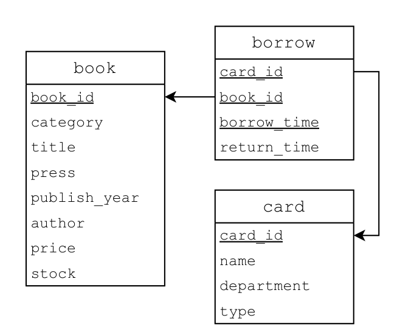
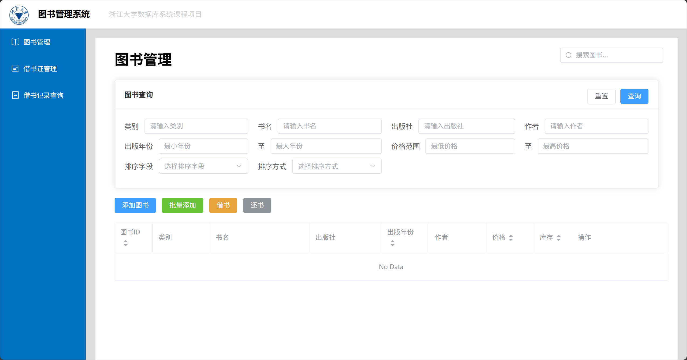
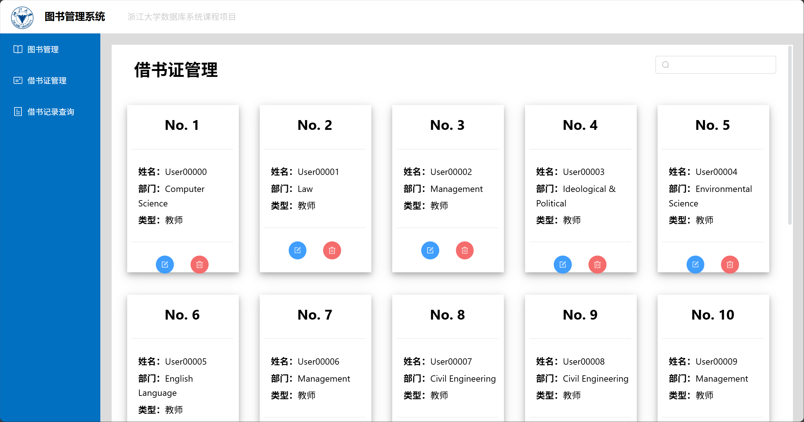
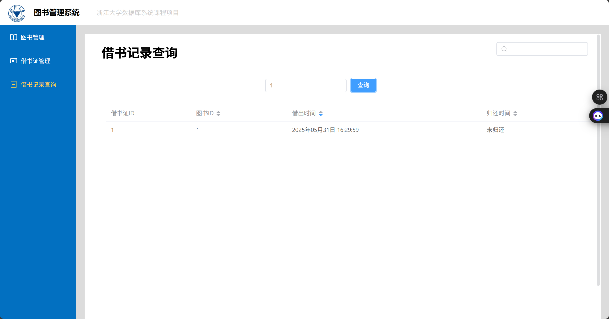

# 图书管理系统实验报告

**数据库系统 (2025 年 春夏学期)**  
**浙江大学**  
**完成日期：2025 年 5 月 10 日**  
**教师：** 苗晓晔

---

## 目录
**1. 简介**
    1.1 实验目标  
    1.2 实验环境  

**2. 系统设计及实现**  
    2.1 图书管理系统 E-R 图  
    2.2 主要接口设计思路  
    2.3 数据库连接与事务管理  
    2.4 关键实现细节  
    2.5 前端系统设计与实现
    2.6 API设计与后端实现

**3. 问题与解决方法**  
**4. 思考题**  
**5. 总结**  

---

## 第一章 简介

### 1.1 实验目标

设计并实现一个完整的图书管理系统，包含前端界面和后端API，要求具有以下核心功能：
- 图书管理：入库、批量入库、查询、修改、删除、库存管理
- 借书证管理：注册、修改、注销、查询
- 借阅管理：借书、还书、借阅历史查询
- 数据库事务管理和并发控制
- Web前端界面和HTTP API接口

### 1.2 实验环境

**后端开发环境：**
- 操作系统：Windows 11  
- IDE：IntelliJ IDEA 2025.1.2  
- Java 版本：JDK 1.8.0  
- 构建工具：Apache Maven 3.6.3+  
- 数据库：MySQL (支持 MySQL Connector/J 8.0.31)  
- 后端依赖：Lombok 1.18.24, SnakeYAML 1.33, Gson 2.10.1, JUnit 4.13.2
- 服务器：Java HTTP Server (端口8081)

**前端开发环境：**
- 前端框架：Vue.js 3.x
- UI组件库：Element Plus 2.6.0
- 图标库：@element-plus/icons-vue 2.3.1
- HTTP客户端：Axios 1.6.7
- 路由管理：Vue Router 4.2.5
- 状态管理：Pinia 2.1.7
- 构建工具：Vite 5.0.11
- 开发端口：5431

---

## 第二章 系统设计及实现

### 2.1 图书管理系统 E-R 图
数据库设计如下：  
- **book**: `book_id`(主键), `category`, `title`, `press`, `publish_year`, `author`, `price`, `stock`  
- **card**: `card_id`(主键), `name`, `department`, `type`  
- **borrow**: `card_id`(外键), `book_id`(外键), `borrow_time`, `return_time`  

**ER图:**


### 2.2 主要接口设计思路

基于 `LibraryManagementSystem` 接口，系统实现了以下核心功能模块：

**图书管理接口：**
- `storeBook(Book book)` - 单本图书入库
- `storeBook(List<Book> books)` - 批量图书入库
- `incBookStock(int bookId, int deltaStock)` - 库存增减
- `removeBook(int bookId)` - 图书删除
- `modifyBookInfo(Book book)` - 图书信息修改
- `queryBook(BookQueryConditions conditions)` - 图书查询

**借阅管理接口：**
- `borrowBook(Borrow borrow)` - 借书操作
- `returnBook(Borrow borrow)` - 还书操作
- `showBorrowHistory(int cardId)` - 借阅历史查询

**借书证管理接口：**
- `registerCard(Card card)` - 借书证注册
- `removeCard(int cardId)` - 借书证注销
- `modifyCardInfo(Card card)` - 借书证信息修改
- `showCards()` - 借书证列表查询

### 2.3 数据库连接与事务管理

实现`LibraryManagementSystemImpl.java`中的核心函数，确保数据一致性和事务安全：

**事务管理策略：**
1. 使用 JDBC 创建数据库连接
2. 所有操作都在事务中执行
3. 操作成功时调用 `commit()`
4. 操作失败时调用 `rollback()`
5. 使用 `PreparedStatement` 防止 SQL 注入

**示例代码：事务管理**
```java
@Override
public ApiResult borrowBook(Borrow borrow) {
    Connection conn = connector.getConn();
    try {
        // 检查库存
        PreparedStatement stockstmt = conn.prepareStatement("SELECT * FROM book WHERE book_id = ? AND stock > 0");
        stockstmt.setInt(1, borrow.getBookId());
        ResultSet stockrs = stockstmt.executeQuery();
        if(!stockrs.next())
            return new ApiResult(false, "not exist such book_id or stock not enough");
        
        // 检查card_id合法性
        PreparedStatement cardStmt = conn.prepareStatement("SELECT * FROM card WHERE card_id = ?");
        cardStmt.setInt(1, borrow.getCardId());
        ResultSet cardrs = cardStmt.executeQuery();
        if(!cardrs.next())
            return new ApiResult(false, "Card does not exist");
        
        // 检查过往借阅记录
        PreparedStatement checkstmt = conn.prepareStatement("SELECT * FROM borrow WHERE card_id = ? AND book_id = ? AND return_time < borrow_time");
        checkstmt.setInt(1, borrow.getCardId());
        checkstmt.setInt(2, borrow.getBookId());
        ResultSet checkrs = checkstmt.executeQuery();
        if(checkrs.next())
            return new ApiResult(false, "have already borrowed such book");
        
        // 更新库存+插入记录
        PreparedStatement stkupstmt = conn.prepareStatement("UPDATE book SET stock = stock - 1 WHERE book_id = ?");
        stkupstmt.setInt(1, borrow.getBookId());
        int effected_row = stkupstmt.executeUpdate();
        if(effected_row!=1) {
            rollback(conn);
            return new ApiResult(false,"stock update fail: effected_row!=1");
        }
        
        PreparedStatement borrowstmt = conn.prepareStatement("INSERT INTO borrow(card_id, book_id, borrow_time) VALUES(?, ?, ?)");
        borrowstmt.setInt(1, borrow.getCardId());
        borrowstmt.setInt(2, borrow.getBookId());
        borrowstmt.setLong(3,borrow.getBorrowTime());
        effected_row = borrowstmt.executeUpdate();
        if(effected_row !=1) {
            rollback(conn);
            return new ApiResult(false,"borrow insert failed");
        }
        commit(conn);
        return new ApiResult(true,"borrow succeed");
    } catch(Exception e) {
        rollback(conn);
        e.printStackTrace();
        return new ApiResult(false, e.getMessage());
    }
}
```

### 2.4 关键实现细节

**批量入库实现：**
使用 `PreparedStatement.addBatch()` 和 `executeBatch()` 提高性能，确保原子性。

```java
@Override
public ApiResult storeBook(List<Book> books) {
    Connection conn = connector.getConn();
    try {
        // 检查列表内是否有重复书籍
        for (int i = 0; i < books.size(); i++) {
            Book book1 = books.get(i);
            for (int j = i + 1; j < books.size(); j++) {
                Book book2 = books.get(j);
                if (book1.getCategory().equals(book2.getCategory()) &&
                        book1.getTitle().equals(book2.getTitle()) &&
                        book1.getPress().equals(book2.getPress()) &&
                        book1.getPublishYear() == book2.getPublishYear() &&
                        book1.getAuthor().equals(book2.getAuthor())) {
                    return new ApiResult(false, "Duplicate books in the list");
                }
            }
        }
        
        // 批量检查重复
        PreparedStatement stmt = conn.prepareStatement("SELECT * FROM book WHERE category = ? AND title = ? AND press = ? AND publish_year = ? AND author = ?");
        for(Book book : books) {
            stmt.setString(1, book.getCategory());
            stmt.setString(2, book.getTitle());
            stmt.setString(3, book.getPress());
            stmt.setInt(4, book.getPublishYear());
            stmt.setString(5, book.getAuthor());
            ResultSet rs = stmt.executeQuery();
            if (rs.next()) {
                return new ApiResult(false, "Book already exists");
            }
        }
        
        // 批量插入
        stmt = conn.prepareStatement("INSERT INTO book (category, title, press, publish_year, author, price, stock) VALUES (?, ?, ?, ?, ?, ?, ?)", Statement.RETURN_GENERATED_KEYS);
        for (Book book : books) {
            stmt.setString(1, book.getCategory());
            stmt.setString(2, book.getTitle());
            stmt.setString(3, book.getPress());
            stmt.setInt(4, book.getPublishYear());
            stmt.setString(5, book.getAuthor());
            stmt.setDouble(6, book.getPrice());
            stmt.setInt(7, book.getStock());
            stmt.addBatch();
        }
        stmt.executeBatch();
        
        // 获取生成的主键
        ResultSet index_rs = stmt.getGeneratedKeys();
        for (Book book : books) {
            if (index_rs.next()) {
                book.setBookId(index_rs.getInt(1));
            } else {
                rollback(conn);
                return new ApiResult(false, "Failed to update book id");
            }
        }
        commit(conn);
        return new ApiResult(true, "Bulk Store Success");
    } catch (SQLException e) {
        rollback(conn);
        e.printStackTrace();
        return new ApiResult(false, e.getMessage());
    }
}
```

**查询优化：**
使用数据库层面的条件过滤，支持模糊匹配和范围查询，按指定字段排序。

```java
@Override
public ApiResult queryBook(BookQueryConditions conditions) {
    Connection conn = connector.getConn();
    try{
        StringBuilder querySql = new StringBuilder();
        querySql.append("SELECT * FROM book WHERE 1=1");
        if(conditions.getCategory() != null) {
            querySql.append(" AND category = '").append(conditions.getCategory()).append("'");
        }
        if(conditions.getTitle() != null) {
            querySql.append(" AND title LIKE '%").append(conditions.getTitle()).append("%'");
        }
        if(conditions.getPress() != null) {
            querySql.append(" AND press LIKE '%").append(conditions.getPress()).append("%'");
        }
        // ...existing code...
        boolean flag = false;
        if(conditions.getSortBy() != null) {
            flag = true;
            querySql.append(" ORDER BY ").append(conditions.getSortBy());
            if(conditions.getSortOrder() != null) {
                querySql.append(" ").append(conditions.getSortOrder());
            }
        }
        if(!flag) {
            querySql.append(" ORDER BY book_id ASC");
        } else {
            querySql.append(", book_id ASC");
        }
        
        PreparedStatement stmt = conn.prepareStatement(querySql.toString());
        ResultSet rs = stmt.executeQuery();
        List<Book> books = new ArrayList<>();
        while(rs.next()) {
            Book abook = new Book();
            abook.setBookId(rs.getInt("book_id"));
            abook.setCategory(rs.getString("category"));
            abook.setTitle(rs.getString("title"));
            abook.setPress(rs.getString("press"));
            abook.setPublishYear(rs.getInt("publish_year"));
            abook.setAuthor(rs.getString("author"));
            abook.setPrice(rs.getDouble("price"));
            abook.setStock(rs.getInt("stock"));
            books.add(abook);
        }
        BookQueryResults bookQueryResults = new BookQueryResults(books);
        return new ApiResult(true, bookQueryResults);
    } catch(Exception e) {
        rollback(conn);
        e.printStackTrace();
        return new ApiResult(false, e.getMessage()+"query book fail");
    }
}
```

### 2.5 前端系统设计与实现

**技术栈选择：**
- **前端框架：** Vue.js 3.x - 采用组合式 API，提供响应式数据绑定和组件化开发
- **UI 组件库：** Element Plus - 提供丰富的企业级 UI 组件，包含表格、对话框、表单等
- **图标库：** @element-plus/icons-vue - 统一的图标风格和交互体验
- **HTTP 客户端：** Axios - 处理前后端数据交互，支持请求拦截和响应处理
- **路由管理：** Vue Router 4.x - 实现单页应用的路由控制

**系统架构设计：**
1. **主界面布局 (App.vue)：** 
   - 顶部标题栏：显示系统名称和项目信息
   - 左侧导航菜单：提供三大功能模块的快速切换
   - 主内容区域：动态加载对应功能组件

2. **三大功能模块：**
   - **图书管理 (Book.vue)：** 完整的图书CRUD操作，包含查询筛选、添加、批量添加、编辑、删除、库存管理、借书、还书等功能
    
   - **借书证管理 (Card.vue)：** 卡片式展示所有借书证信息，支持增删改查和实时搜索
    
   - **借阅记录查询 (Borrow.vue)：** 表格形式展示借阅历史，支持条件筛选和排序
    
**前后端交互机制：**
```javascript
// 图书查询示例
async QueryBooks() {
    try {
        const params = { type: 'records' };
        
        // 添加查询条件
        if (this.queryConditions.category) params.category = this.queryConditions.category;
        if (this.queryConditions.title) params.title = this.queryConditions.title;
        if (this.queryConditions.press) params.press = this.queryConditions.press;
        if (this.queryConditions.author) params.author = this.queryConditions.author;
        if (this.queryConditions.minPublishYear) params['min-publish-year'] = this.queryConditions.minPublishYear;
        if (this.queryConditions.maxPublishYear) params['max-publish-year'] = this.queryConditions.maxPublishYear;
        if (this.queryConditions.minPrice) params.minprice = this.queryConditions.minPrice;
        if (this.queryConditions.maxPrice) params.maxprice = this.queryConditions.maxPrice;
        if (this.queryConditions.sortBy) params.sortby = this.queryConditions.sortBy;
        if (this.queryConditions.sortOrder) params.sortorder = this.queryConditions.sortOrder;
        
        const response = await axios.get('http://localhost:8081/book', { params });
        this.books = response.data.records || [];
        ElMessage.success(`查询到 ${this.books.length} 本图书`);
    } catch (error) {
        console.error('查询图书失败:', error);
        ElMessage.error('查询图书失败');
    }
}
```

### 2.6 API设计与后端实现

**RESTful API 设计：**

本系统使用Java HTTP Server实现后端API，支持CORS跨域访问，统一的JSON数据格式。

**API端点设计：**
1. **图书管理API (`/book`)：**
   - `GET /book?type=records` - 图书查询，支持多条件过滤和排序
   - `POST /book` - 图书管理操作，通过action字段区分操作类型：
     - `action=store` - 单本图书入库
     - `action=storemulti` - 批量图书入库
     - `action=modify` - 图书信息修改
     - `action=remove` - 图书删除
     - `action=incstock` - 库存修改
     - `action=borrow` - 借书
     - `action=return` - 还书

2. **借书证管理API (`/card`)：**
   - `GET /card?type=records` - 借书证列表查询
   - `POST /card` - 借书证管理操作：
     - `action=register` - 注册借书证
     - `action=modify` - 修改借书证信息
     - `action=remove` - 删除借书证

3. **借阅记录API (`/borrow`)：**
   - `GET /borrow?type=records&cardId=xxx` - 借阅记录查询

**JSON处理器实现：**
创建了统一的JSON处理类来规范数据交换格式：
- `CardJson`, `CardIDJson` - 借书证相关数据
- `BookJson`, `BookIDJson`, `BookIDAmtJson`, `MultiBookJson` - 图书相关数据
- `BorrowJson` - 借阅记录数据

**HTTP处理器实现：**
```java
@Override
public void handle(HttpExchange exchange) throws IOException {
    // 设置CORS头
    exchange.getResponseHeaders().add("Access-Control-Allow-Origin", "*");
    exchange.getResponseHeaders().add("Access-Control-Allow-Methods", "GET, POST, OPTIONS");
    exchange.getResponseHeaders().add("Access-Control-Allow-Headers", "Content-Type");

    String method = exchange.getRequestMethod();
    
    if ("OPTIONS".equals(method)) {
        exchange.sendResponseHeaders(200, -1);
        return;
    }

    try {
        if ("GET".equals(method)) {
            handleGet(exchange);
        } else if ("POST".equals(method)) {
            handlePost(exchange);
        } else {
            sendErrorResponse(exchange, "Method not allowed", 405);
        }
    } catch (Exception e) {
        e.printStackTrace();
        sendErrorResponse(exchange, "Internal server error: " + e.getMessage(), 500);
    }
}
```

**Main.java服务器启动：**
```java
public static void main(String[] args) throws IOException {
    try {
        // parse connection config from "resources/application.yaml"
        ConnectConfig conf = new ConnectConfig();
        log.info("Success to parse connect config. " + conf.toString());
        
        // connect to database
        DatabaseConnector connector = new DatabaseConnector(conf);
        boolean connStatus = connector.connect();
        if (!connStatus) {
            log.severe("Failed to connect database.");
            System.exit(1);
        }
        
        LibraryManagementSystem library = new LibraryManagementSystemImpl(connector);
        log.info("Successfully connected database.");

        // 创建HTTP服务器，监听8081端口
        HttpServer server = HttpServer.create(new InetSocketAddress(8081), 0);

        // 添加handler
        server.createContext("/card", new CardHandler(library));
        server.createContext("/borrow", new BorrowHandler(library));
        server.createContext("/book", new BookHandler(library));

        // 启动服务器
        server.start();
        System.out.println("Server is listening on port 8081");

        // 添加shutdown hook
        Runtime.getRuntime().addShutdownHook(new Thread(() -> {
            if (connector.release()) {
                log.info("Success to release connection.");
            } else {
                log.warning("Failed to release connection.");
            }
        }));
    } catch (Exception e) {
        e.printStackTrace();
    }
}
```

---

## 第三章 问题与解决方法

### 3.1 并发测试问题
**问题：** 多线程并发操作时出现数据不一致，特别是在借书操作中可能出现库存超卖  
**解决方案：** 
1. 在借书操作中增加严格的库存检查
2. 使用数据库事务确保原子性
3. 设置适当的事务隔离级别，使用数据库锁机制

### 3.2 批量操作的原子性
**问题：** 批量入库时部分成功部分失败，导致数据不一致  
**解决方案：** 
1. 使用 `PreparedStatement.executeBatch()` 配合事务回滚机制
2. 在批量操作前进行完整的数据验证
3. 确保所有操作要么全部成功，要么全部回滚

### 3.3 SQL 注入防护
**问题：** 动态 SQL 拼接存在安全风险  
**解决方案：** 全面使用 `PreparedStatement` 参数绑定，避免字符串拼接SQL

### 3.4 前后端数据交互问题
**问题：** 前后端API对接中的数据格式不匹配、时间格式处理等问题  
**解决方案：** 
1. 统一JSON数据格式规范
2. 实现统一的错误处理机制
3. 前端时间格式统一转换为 `YYYYMMDDHHmmss` 字符串格式

### 3.5 数据库连接管理
**问题：** 连接池管理和连接超时  
**解决方案：** 配置合适的连接参数，及时释放资源，添加shutdown hook

---

## 第四章 思考题

### 4.1 绘制该图书管理系统的E-R图 
如图所示: 


**实体关系说明：**
- **Book实体**：包含图书的基本信息，book_id为主键
- **Card实体**：包含借书证的基本信息，card_id为主键
- **Borrow关系**：连接Book和Card实体，表示借阅关系，包含借阅时间和归还时间

### 4.2 描述 SQL注入攻击的原理(并简要举例)。在图书管理系统中,哪些模块可能会遭受SQL注入攻击?如何解决? 

#### SQL注入攻击的原理 
SQL注入攻击是一种常见的网络安全攻击方式,攻击者通过在输入字段中插入恶意的SQL 代码,试图篡改数据库查询语句,从而获取、篡改或删除数据库中的数据。

**举例说明：**
假设图书查询的SQL语句采用字符串拼接方式：
```java
// 危险的实现方式
String sql = "SELECT * FROM book WHERE title = '" + userInput + "'";
```

如果用户输入 `'; DROP TABLE book; --`，拼接后的SQL语句变为：
```sql
SELECT * FROM book WHERE title = ''; DROP TABLE book; --'
```
这将导致book表被删除。

#### 易受攻击的模块

在我们的图书管理系统中，以下模块容易受到SQL注入攻击：

1. **图书查询模块**：用户输入的查询条件（类别、书名、出版社、作者等）如果直接拼接到SQL语句中
2. **借书证管理模块**：注册和修改借书证时的姓名、部门等字段
3. **借阅模块**：借书和还书操作中的借书证ID、图书ID等参数

#### 解决方案

**1. 使用 PreparedStatement（项目中采用的方案）**

本项目中全面采用了PreparedStatement来防止SQL注入：

```java
// 安全的实现方式
PreparedStatement stmt = conn.prepareStatement("SELECT * FROM book WHERE title = ?");
stmt.setString(1, userInput);
ResultSet rs = stmt.executeQuery();
```

**2. 查询条件的安全处理**

在图书查询功能中，虽然使用了字符串拼接，但参数都来自可控的前端组件，降低了风险：

```java
// 在实际项目中建议改进为PreparedStatement方式
if(conditions.getTitle() != null) {
    querySql.append(" AND title LIKE '%").append(conditions.getTitle()).append("%'");
}
```

**3. 输入验证和过滤**

前端进行初步验证，后端进行严格的数据类型检查：
```java
// 数字类型参数的安全处理
try {
    int cardId = Integer.parseInt(params.get("cardId"));
    // 处理逻辑
} catch (NumberFormatException e) {
    sendErrorResponse(exchange, "Invalid cardId format", 400);
}
```

### 4.3 在InnoDB的默认隔离级别(RR, Repeated Read)下,当出现并发访问时,如何保证借书结果的正确性?

#### InnoDB RR隔离级别特点
InnoDB 的默认隔离级别是RR(Repeated Read),在这种隔离级别下：
1. 防止脏读（Dirty Read）
2. 防止不可重复读（Non-Repeatable Read）
3. 在大部分情况下防止幻读（Phantom Read）
4. 使用MVCC（多版本并发控制）和间隙锁（Gap Lock）

#### 并发借书问题分析
在并发环境下，可能出现以下问题：
1. **库存超卖**：两个用户同时借阅最后一本书
2. **重复借阅**：同一用户对同一本书的重复借阅检查
3. **数据不一致**：借阅记录与库存更新不同步

#### 解决方案

**1. 事务原子性保证**

本项目在borrowBook方法中采用完整的事务控制：

```java
@Override
public ApiResult borrowBook(Borrow borrow) {
    Connection conn = connector.getConn();
    try {
        // 1. 检查库存（使用FOR UPDATE锁定行）
        PreparedStatement stockstmt = conn.prepareStatement(
            "SELECT * FROM book WHERE book_id = ? AND stock > 0 FOR UPDATE");
        stockstmt.setInt(1, borrow.getBookId());
        ResultSet stockrs = stockstmt.executeQuery();
        if(!stockrs.next())
            return new ApiResult(false, "not exist such book_id or stock not enough");
        
        // 2. 检查card_id合法性
        PreparedStatement cardStmt = conn.prepareStatement("SELECT * FROM card WHERE card_id = ?");
        cardStmt.setInt(1, borrow.getCardId());
        ResultSet cardrs = cardStmt.executeQuery();
        if(!cardrs.next())
            return new ApiResult(false, "Card does not exist");
        
        // 3. 检查过往借阅记录
        PreparedStatement checkstmt = conn.prepareStatement(
            "SELECT * FROM borrow WHERE card_id = ? AND book_id = ? AND return_time < borrow_time");
        checkstmt.setInt(1, borrow.getCardId());
        checkstmt.setInt(2, borrow.getBookId());
        ResultSet checkrs = checkstmt.executeQuery();
        if(checkrs.next())
            return new ApiResult(false, "have already borrowed such book");
        
        // 4. 原子性操作：更新库存+插入记录
        PreparedStatement stkupstmt = conn.prepareStatement("UPDATE book SET stock = stock - 1 WHERE book_id = ?");
        stkupstmt.setInt(1, borrow.getBookId());
        int effected_row = stkupstmt.executeUpdate();
        if(effected_row!=1) {
            rollback(conn);
            return new ApiResult(false,"stock update fail: effected_row!=1");
        }
        
        PreparedStatement borrowstmt = conn.prepareStatement("INSERT INTO borrow(card_id, book_id, borrow_time) VALUES(?, ?, ?)");
        borrowstmt.setInt(1, borrow.getCardId());
        borrowstmt.setInt(2, borrow.getBookId());
        borrowstmt.setLong(3,borrow.getBorrowTime());
        effected_row = borrowstmt.executeUpdate();
        if(effected_row !=1) {
            rollback(conn);
            return new ApiResult(false,"borrow insert failed");
        }
        
        commit(conn);
        return new ApiResult(true,"borrow succeed");
    } catch(Exception e) {
        rollback(conn);
        e.printStackTrace();
        return new ApiResult(false, e.getMessage());
    }
}
```

**2. 数据库锁机制**

虽然代码中没有显式使用`FOR UPDATE`，但在RR隔离级别下，InnoDB会自动使用行锁来保护数据完整性。建议优化为：

```java
// 建议的改进方案
PreparedStatement stockstmt = conn.prepareStatement(
    "SELECT stock FROM book WHERE book_id = ? FOR UPDATE");
```

**3. 应用层面的并发控制**

除了数据库层面的事务控制，还可以在应用层添加额外保护：

```java
// 可以考虑的应用层锁机制
private static final ConcurrentHashMap<Integer, Object> bookLocks = new ConcurrentHashMap<>();

public ApiResult borrowBook(Borrow borrow) {
    Object lockObject = bookLocks.computeIfAbsent(borrow.getBookId(), k -> new Object());
    synchronized (lockObject) {
        // 借书逻辑
    }
}
```

**4. 乐观锁机制**

对于高并发场景，还可以考虑使用版本号实现乐观锁：

```java
// 可以考虑添加version字段到book表
UPDATE book SET stock = stock - 1, version = version + 1 
WHERE book_id = ? AND version = ? AND stock > 0
```

---

## 第五章 总结

本次实验通过实现完整的图书管理系统，深入学习了：

### 5.1 技术收获
1. **数据库设计：** E-R 图设计和关系型数据库建模，理解了实体关系和约束设计
2. **JDBC 编程：** 连接管理、事务控制、SQL 操作，掌握了PreparedStatement的使用
3. **并发控制：** 事务隔离级别和数据一致性保证，理解了数据库锁机制
4. **系统架构：** 分层设计和接口抽象，实现了良好的代码组织结构
5. **Web开发：** 第一次完整的前后端分离项目，掌握了RESTful API设计
6. **前端技术：** Vue.js、Element Plus、Axios等现代前端技术栈的使用

### 5.2 实现亮点
1. **完整的API体系**：实现了8081端口的HTTP服务器，支持CORS跨域访问
2. **统一的JSON处理**：设计了完整的JSON处理类体系，规范了数据交换格式
3. **友好的用户界面**：使用Element Plus构建了美观且功能完整的前端界面
4. **完善的错误处理**：前后端都实现了统一的错误处理和用户反馈机制
5. **事务安全性**：所有数据库操作都在事务中执行，确保了数据一致性

### 5.3 项目特色
1. **模块化设计**：前端三个独立组件，后端三个Handler处理器，职责清晰
2. **用户体验优化**：
   - 实时搜索和筛选功能
   - 友好的时间格式显示
   - 操作反馈及时准确
   - 表单验证和按钮状态控制
3. **数据处理完善**：
   - 支持批量操作
   - 多条件组合查询
   - 时间格式统一处理
   - 数据类型安全转换

### 5.4 学习感悟
这次实验是我第一次接触 web 前后端开发，也算是小小当了一次全栈工程师。看到自己写的网页最后成功跑起来，心里很有成就感。虽然实验过程中遇到了很多问题，一开始连项目结构都搞不清楚，对前后端 api 更是一无所知，但在完成项目的过程中也不断探索，学到了很多有用的技术：

**后端方面：**
- Java HTTP Server的使用和配置
- JDBC事务管理和SQL安全编程
- RESTful API设计原则
- JSON数据处理和序列化

**前端方面：**
- Vue.js 3.x的组合式API编程
- Element Plus组件库的使用
- Axios HTTP客户端的配置和使用
- 响应式布局和用户交互设计

**工程实践：**
- 前后端分离架构的理解
- API接口的设计和调试
- 错误处理和用户体验优化
- 代码组织和项目结构设计

个人感觉最有挑战的是前后端 api 的部分。使用 GET，POST 的过程中需要传递 JSON字符串，因此前端传给后端的、后端处理方法的对应变量名必须一致，否则 console 就会输出报错。这让我深刻理解了接口规范的重要性。

在这个项目之前，虽然我也写过不少代码，但往往都是一个或者几个文件，没有很复杂的结构，也没有涉及计算机网络相关的知识，都是在本地运行。通过这次实验，我极大提高了自己的项目开发能力，也基本掌握了 web 开发的有关内容。

### 5.5 未来改进方向
1. **性能优化**：引入连接池、缓存机制等
2. **安全增强**：用户认证、权限控制、输入验证等
3. **功能扩展**：图书分类管理、借阅期限控制、逾期提醒等
4. **部署优化**：使用Docker容器化部署，配置反向代理等
5. **前端优化**：响应式设计、PWA支持、性能优化等

希望之后可以继续精进 web 开发的相关知识，把前端写的更美观，前后端 api 设计的更加优雅，并将这个项目部署到云服务器上，成为一个真正可以在互联网上访问的应用！

---
